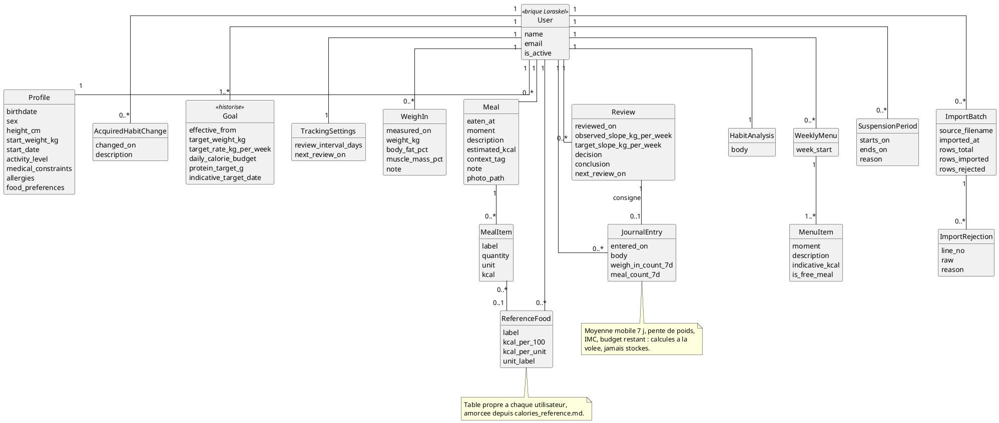
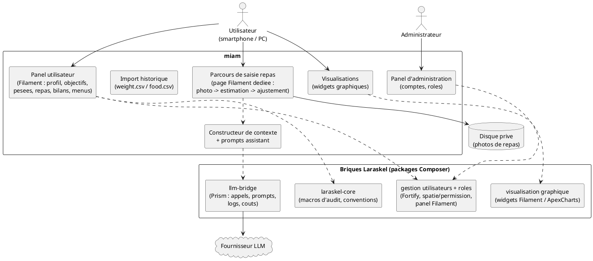

# Note de design — Suivi de poids et de calories (miam)

- **Statut** : vivant
- **Date** : 2026-09-01
- **Périmètre** : application `miam` (v1 / MVP)
- **PRD lié** : [suivi-poids-calories.md](../prds/suivi-poids-calories.md)
- **Documents liés** : Laraskel — `doc/design/distribution-packages.md` (consommation des
  briques), `doc/design/socle-auth-roles.md` (auth/rôles/audit), `doc/prds/interface-llm.md`,
  `doc/prds/navigation-dashboards.md`, `README.md` §7 (visualisation)

Note d'architecture minimaliste : elle fixe le schéma de données, les briques Laraskel
consommées, la frontière avec l'assistant LLM et la séparation des responsabilités. Le
détail d'implémentation (classes, migrations, écrans) relève du plan `doc/plans/` et du
code.

---

## 1. Contexte et contraintes

- Application **web multi-utilisateur** bâtie sur Laraskel, données **en base** (là où
  `pdp` tenait des fichiers texte mono-utilisateur).
- **Mono-tenant** : une instance, plusieurs utilisateurs isolés. Pas de multi-tenant
  (PRD §5.2).
- **En ligne uniquement** : pas de mode hors-ligne ni de file d'attente locale
  (PRD §9). L'estimation par photo suppose une connexion au moment du repas.
- **Données de santé sensibles** (photos d'assiette, contraintes médicales, historique
  de poids) : isolation stricte par utilisateur (FR-5, y compris vis-à-vis de
  l'administrateur), et effacement complet à la demande (§7).
- Le cœur transverse (auth, rôles, audit, graphiques, pont LLM) est **fourni par
  Laraskel** et consommé par composition — jamais recodé ni copié (§2).

## 2. Briques Laraskel consommées

| Brique | Rôle dans miam | État |
|---|---|---|
| `laraskel-core` | Macros de schéma `auditColumns()`, conventions | **Consommée** (path repository) |
| **gestion utilisateurs + rôles** | Comptes créés par l'administrateur, rôles plats `admin` / `utilisateur`, désactivation/réactivation, réinitialisation de mot de passe, panel d'administration Filament (FR-1, FR-2) | **Pas encore extraite en package** → §2.1 |
| **visualisation graphique** | Courbes poids / IMC / calories, vue budget hebdomadaire (FR-28→FR-36) | À extraire (Laraskel `README` §7) |
| **pont LLM** (`llm-bridge`) | Estimation calorique texte + photo, assistant de coaching (FR-15, FR-16, FR-44→FR-46) | À extraire (Laraskel `prds/interface-llm.md`) |
| **stockage d'image** | Photo attachée à un repas (FR-19) — **pas** la médiathèque complète (PRD §5.2) | Sous-ensemble minimal, cf. §7 |

### 2.1 Dépendance bloquante — la brique utilisateurs/rôles

miam n'a aucune fonction utile sans comptes. Cette brique existe dans `laraskel/app/`
(Fortify + `spatie/laravel-permission` + modèle `User` + panel Filament, cf.
`socle-auth-roles.md`) mais **n'est pas encore un package Composer**.

**Retenu.** Son extraction est un préalable au premier lot fonctionnel de miam. Le
découpage (package dédié `laraskel-users` ou intégration à `laraskel-core`) est une
décision **côté Laraskel** (cf. sa priorisation `doc/todo.md` §2) ; miam se contente de
la `require` et d'**étendre `User` par composition** (`class User extends
Laraskel\...\User`) pour y accrocher les relations du domaine (§3).

### Alternatives écartées

| Option | Raison de l'écart |
|---|---|
| Recoder l'authentification et les rôles dans miam | Duplique ce que le socle doit fournir ; contraire à la raison d'être de Laraskel. |
| Copier les fichiers de la brique depuis `laraskel/app/` vers miam | Rompt la propagation des mises à jour (cf. `distribution-packages.md`). |
| Démarrer miam avant l'extraction, avec un `User` maison provisoire | Migration douloureuse ensuite (FK `created_by`/`updated_by`, `spatie` déjà câblés sur un autre modèle). |

## 3. Schéma de données

Toutes les tables du domaine portent les colonnes d'audit (`created_at`/`updated_at`,
`created_by`/`updated_by`) via `auditColumns()` ; `users` est fournie par la brique
Laraskel et exemptée (`.ai/rules/migrations.md`).

Décisions de modélisation :

- **Isolation par utilisateur.** Chaque table du domaine porte `user_id`. Une *global
  scope* Eloquent (ou une policy systématique) restreint tout accès aux lignes de
  l'utilisateur courant ; l'administrateur n'y échappe pas (FR-5).
- **Objectif historisé** (`goals`). Un changement d'objectif crée une **nouvelle ligne**
  (`effective_from` + valeurs) ; l'objectif courant est la ligne la plus récente. Pas de
  mise à jour en place, pas de table d'historique séparée (FR-9).
- **Repas et lignes de repas.** `Meal` porte l'estimation totale et les métadonnées
  (moment, tag de contexte, note, photo) ; `MealItem` porte le détail aliment /
  quantité / kcal issu de l'assistant, corrigé par l'utilisateur avant enregistrement
  (FR-15, FR-16). Un `MealItem` peut référencer un `ReferenceFood` (FR-25).
- **Table de référence par utilisateur** (`reference_foods`). Amorcée à la création du
  compte depuis `calories_reference.md`. Un aliment estimé avec une quantité précise et
  absent de la table y est ajouté à l'enregistrement du repas, sans confirmation
  (FR-23) ; une entrée existante recevant une estimation nettement différente est
  **ajustée**, jamais dupliquée (FR-24).
- **Bilan** (`reviews`). Chaque bilan fixe la date du suivant (`next_review_on`) ; la
  date de prochain bilan « active » vit sur `tracking_settings` (avec l'intervalle
  configurable, FR-42) pour être lisible sans recharger le dernier bilan.
- **Journal de suivi** (`journal_entries`). Entrées datées, plus récente en premier ;
  chacune fige la régularité de saisie de la période (`weigh_in_count_7d`,
  `meal_count_7d`, FR-48). Une entrée peut être rattachée au bilan qui l'a produite
  (FR-41).
- **Documents « vivants ».** `HabitAnalysis` (une par utilisateur) et `WeeklyMenu` +
  `MenuItem` sont des contenus éditables, distincts du journal réel (FR-49, FR-52).
- **Import** (`import_batches` + `import_rejections`). Chaque import trace son bilan
  (lignes totales / importées / rejetées) et les lignes rejetées avec leur motif
  (FR-57). L'idempotence (FR-58) repose sur une **clé naturelle** par ligne (utilisateur
  + date + type + charge utile normalisée) vérifiée avant insertion — pas de nouvelle
  table.
- **Périodes de suspension** (`suspension_periods`). Consultées par les calculs de pente
  et l'alarme de régularité pour exclure les intervalles concernés (FR-43, FR-60,
  FR-61).

## 4. Calculs dérivés — jamais stockés

Volume de données faible (au plus quelques pesées et repas par jour et par utilisateur) :
tous les agrégats sont calculés à la volée par des services dédiés, sans colonne ni vue
matérialisée.

| Calcul | Service | Entrées |
|---|---|---|
| Moyenne mobile 7 j du poids, pente kg/semaine (FR-13, FR-14) | `WeightTrend` | pesées, périodes de suspension |
| IMC + zone de corpulence (FR-29) | `Bmi` | poids courant, taille |
| Budget calorique initial : Mifflin-St Jeor × facteur d'activité − déficit (FR-6, FR-7) | `CalorieBudget` | profil, rythme visé |
| Budget restant du jour (FR-17), budget hebdomadaire (FR-31) | `DailyBalance` | objectif courant, repas de la période |
| Régularité de saisie, détection de baisse (FR-51) | `LoggingRegularity` | pesées, repas, suspensions |

Le **facteur d'activité** (PRD §9, à définir) est une échelle fermée de niveaux
(p. ex. sédentaire 1,2 · léger 1,375 · modéré 1,55 · soutenu 1,725 · intense 1,9),
portée par une énumération `ActivityLevel` ; le profil stocke le niveau, pas le facteur.

## 5. Frontière avec l'assistant (LLM)

Toute interaction avec un modèle passe par la brique **`llm-bridge`** (Prism) : appels
multi-provider, prompts internes, journalisation, coûts. miam **ne parle jamais
directement à un fournisseur**.

miam apporte :

1. **Un constructeur de contexte** (`AssistantContext`) : sérialise profil, objectif
   courant + historique, N dernières pesées, N derniers repas, table de référence,
   analyse des habitudes, dernières entrées de journal (FR-45).
2. **Le prompt système « diététicien / nutritionniste »** (repris des consignes de
   `pdp`) : analyses fondées sur des données établies, aveu d'incertitude plutôt
   qu'extrapolation (FR-44).
3. **Des cas d'usage typés** :
   - *estimer un repas* (texte ou photo) → réponse **structurée**
     `{ aliments: [{ libellé, quantité, unité, kcal }], kcal_total }` que miam mappe en
     `MealItem` ; l'utilisateur corrige avant enregistrement (FR-15, FR-16) ;
   - *proposer un menu de semaine* (FR-54) ;
   - *dialogue de coaching* texte + image (FR-46).

**Mode dégradé.** Si le pont est indisponible, miam l'affiche explicitement et laisse
l'utilisateur saisir manuellement les calories d'un repas (jamais d'échec silencieux,
`.ai/rules/app.md`). L'estimation par photo n'est pas rejouée en différé (§1).

## 6. Architecture d'interface et séparation des responsabilités

**Retenu.** miam est une **application Filament** : un panel d'administration (fourni par
la brique utilisateurs/rôles) et un **panel utilisateur** pour le suivi. Les écrans
courants (profil, objectifs, pesées, repas, table de référence, bilans, menus, journal)
sont des *resources* Filament ; le parcours de saisie d'un repas depuis le smartphone
(CU-1 : photo → estimation → ajustement en une opération) et le bilan périodique (CU-3)
sont des **pages Filament dédiées**. Les visualisations sont des **widgets graphiques**
(brique visualisation).

Raisons : Filament v5 est déjà le socle d'IHM de Laraskel (panels, tables, formulaires,
widgets de graphiques), il est responsive, et la charte impose « Livewire uniquement via
Filament ». Un seul système d'IHM à maintenir.

Responsabilités :

- **miam** : le domaine (entités du §3), les calculs (§4), la construction du contexte
  et des prompts de l'assistant (§5), l'import, les écrans et parcours.
- **Briques Laraskel** : authentification, rôles, audit, rendu des graphiques, appels
  LLM.
- **Hors application** : le fournisseur LLM (via le pont), le disque privé des photos.

### Alternatives écartées

| Option | Raison de l'écart |
|---|---|
| App utilisateur en Blade + Livewire sur mesure (hors Filament) | Contraire à la charte Laraskel (« Livewire uniquement via Filament ») ; deux systèmes d'IHM à maintenir. Réévaluable si le parcours mobile s'avère trop contraint dans Filament — ce serait alors un écart documenté. |
| App utilisateur en Blade + Alpine.js + Chart.js, sans Livewire | Respecte la charte mais réécrit tables, formulaires et widgets que Filament fournit déjà ; coût sans bénéfice à ce stade. |
| SPA (Inertia + Vue) | Stack absente de Laraskel (PRD §2.3) ; introduit un front à part entière. |

## 7. Confidentialité et cycle de vie des données

- **Photos de repas** : stockées sur un **disque privé** (hors `public/`), jamais servies
  en direct — accès par URL signée à durée limitée. Pas de `spatie/medialibrary` (PRD
  §5.2 exclut la médiathèque) : un chemin de fichier sur `Meal` suffit ; la suppression
  de la photo n'efface pas le repas (FR-19).
- **Effacement total** (PRD §9) : une action utilisateur supprime l'ensemble de ses
  données de suivi et ses photos. Les FK `created_by` / `updated_by` étant `nullOnDelete`,
  la suppression d'un compte par l'administrateur ne casse pas l'intégrité ; l'effacement
  des données de suivi est une opération distincte, déclenchée par l'utilisateur.
- **Isolation** : cf. §3 (global scope / policies). Aucune vue inter-utilisateurs, y
  compris pour l'administrateur (FR-5).

## 8. Dépendances et ordonnancement

L'ordre des lots (détaillé dans `doc/plans/`) découle des dépendances entre briques :

1. **Brique utilisateurs/rôles** (Laraskel) extraite et consommée → comptes, profil.
2. **Objectifs + pesées + courbe de poids** — ne dépend que de `laraskel-core` et de la
   brique visualisation.
3. **Journal alimentaire + table de référence** — saisie manuelle d'abord.
4. **Pont LLM** extrait et consommé → estimation texte/photo, assistant de coaching,
   proposition de menus.
5. **Bilan périodique, vues de contexte, import** — s'appuient sur les données
   accumulées aux lots précédents.
